# Cesar_coding_with_Spark

## Implementation of Cesar coding

The problem I decided to tackle is in correlation with cryptographic security &amp; BigData. We all know that plenty of messages are exchanges all over the world. Even though some of them are ciphered with different technics (which are sometimes opaque), some are in plain test.

The goal of this project is to implement a ciphering and deciphering method on text messages. We want that knowing the original language in which the message is written and the ciphering algorithm (here Cesar), the people receiving the message to be able to decode it in order to read the original text.

To do so I will use some heuristic properties about the reparation of the most used letter in each languages. The final goal would be to have a system able to take a plain text as an entry, then able to cipher it. After that using the same system, the receiver use heuristic analysis to guess the letter &quot;translation&quot; number (example &quot;a&quot; becomes &quot;e&quot; and &quot;c&quot; becomes &quot;g&quot;) and then decode the text and generate the plain text without knowing that value (it is not sent with the message).

# Objectives:

- The system must be able to read text files
- The system must be able to cipher text
- The system must be able to &quot;guess&quot; the ciphering key (aka the number representing the translation)
- The system must be able to decode a message
- The system must be able to write the decoded message in a text file

# Technologies chosen

- **Spark** (for the majority of treatment ciphering and decoding) on Databricks
- **Hadoop** (to use the effectiveness of the cluster and execute Map reduce)

# Implementation

As it was precised previously this algorithm is supposed to be able to do the jobs: ciphering or deciphering.

## The Cesar code

The text will be cipher with Cesar code. It I a simple way to code a message. The letters are simply rotated in the alphabetic table all by the same value.

Example: **Cesar** becomes with a ciphering key of **2** : **Eguct** (new letter = new letter +2).

If the resulting letter goes out of the range of a-z, it is brought back inside from the other side of the sequence. We can see this here r alphabet as a permutation circle.

Example: **zeta** with a ciphering key of **3** is **Chsd**

As we can see, our ciphering method is just a translation of letter socypherg with a key of +2 and then with a key of -2 gives us back our text

Example: **TEST** becomes with a ciphering key of + **2** : **VGUV** then ciphering it with a key of **-2** gives us our text back: **TEST**

## Ciphering Deciphering

### First Version on Python

We first implemented it on python

- A function &quot;cypherletter&quot; returns the letter ciphered by the precised offset
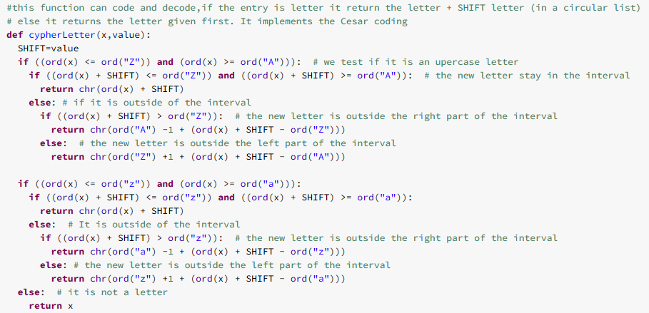 

-
  - So as we can see we test if our letter is an uppercase or lowercase (else it is not a letter so we do not cipher it)
  - Then we verify if the offseted letter is still in the alphabet range. If it is not it is brough back inside
  - We then return the new letter

As we can see the entries are letter to change and the &quot;offset&quot; to apply. It can be positive or negative thus the possibility to cipher and decipher.

-
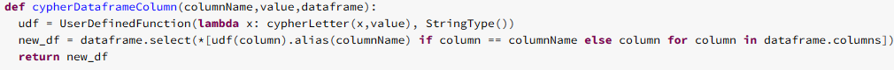 

A function &quot;cypherDataframeColumn&quot; is then able to apply this function to a full column of the dataframe

A function &quot;cypherDataframeColumn&quot; is then able to apply this function to a full column of the dataframe

### Second Version with Map/reduce

We implemented the same function able to &quot;shift letters&quot; in java in our M/R job:

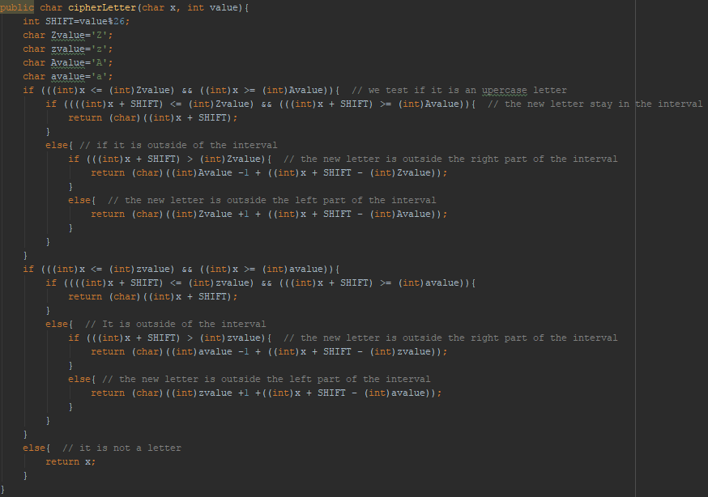 

We choose our **mapper to only map the line number** in order to keep the text in the same order is it was previously

- The character change by itself is done in the reducer class

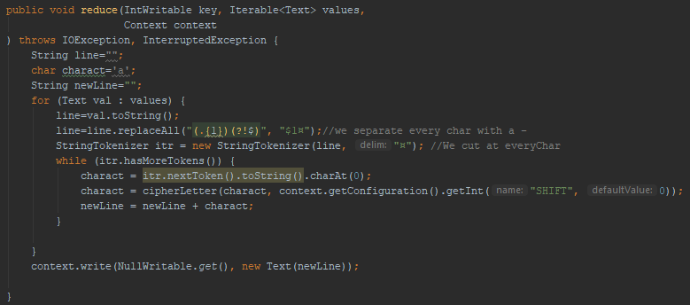 

- To apply our treatment to every char we separate them using the symbol &quot;¤&quot;
- Then we go through every element of the splited list to change the character (the cypherLetter function only modifying letter and letting everything else intact)
- Finally we write our new elements, giving a Null Value as a key in order not to have a key displayed (we also changed the split between key and value to become nothing instead of tabulation and the output of the reducer to be a NullWritable)

### Execution result on the cluster

To test our Map/Reduce we took a book as a text file (A Tale of Two Cities, by Charles Dickens, a 758ko file).

- We putted it on the cluster in an input folder called &quot;inputCipher&quot;
- We putted our jar on the cluster and prepared it

 

- We executed it on our book file, with a ciphering key of 3
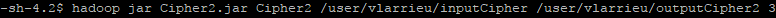 

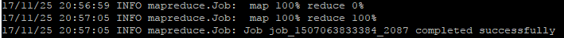 

#### Result of the ciphering Job

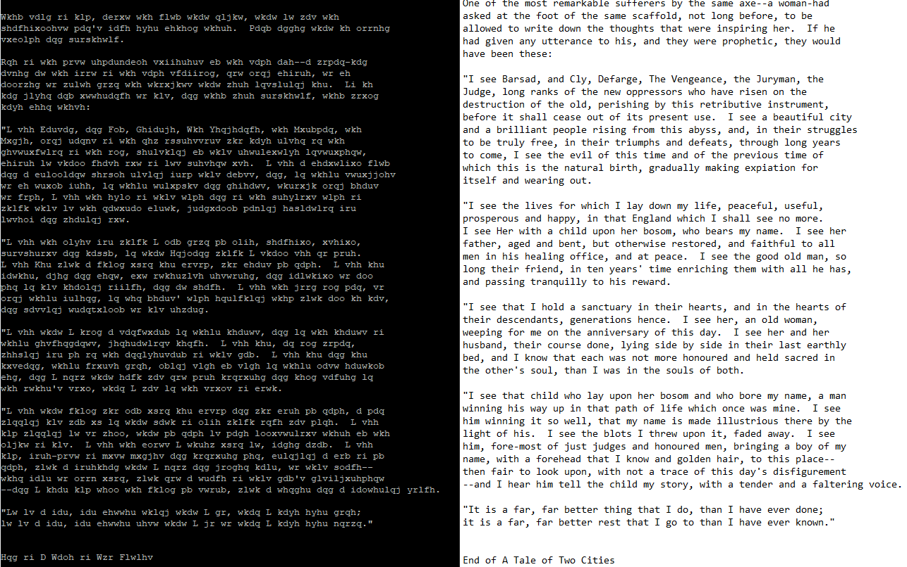 

(with ciphering of 3 compared with the original text)

- As we can see the text has been shifted 3 times on the &quot;right&quot;

- We then now Execute again the job taking that file as an entry and a ciphering key of -3
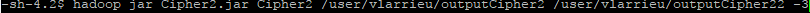 
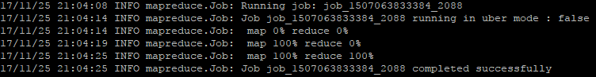 

#### Result of the deciphering job

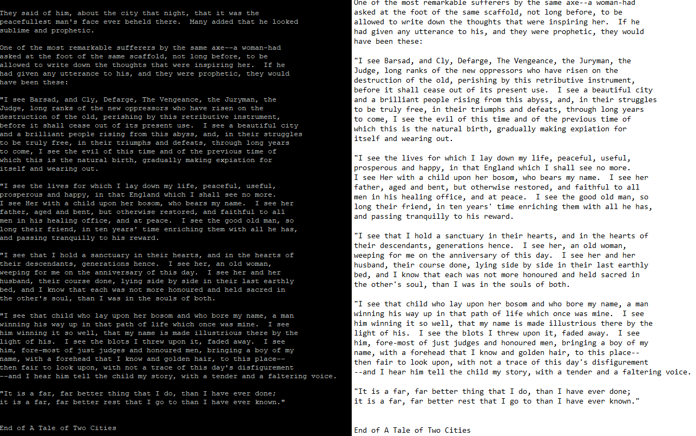 

- As we can see **we successfully ciphered/deciphered the text**

## Frequency analysis

To know the ciphering key only having the ciphered text impose us to do an analysis. Here the heurist approach was chosen. We used it simplified version: In the majority of language, the proportion of each letter in a text is not equal. In fact some letters tend to be more frequent depending the language. In Latin based languages the most frequent letter is most of the time &quot;a&quot; or &quot;e&quot;. We will focus here on the first most represented letter in some languages.

So what we need to do is first to construct a table associating the language with it most frequent letter

### Most Frequent letter by country

- The function &quot;generateMostFreqLetterByCountryDF&quot; returns a Dataframe with the language and his corresponding most frequent letter

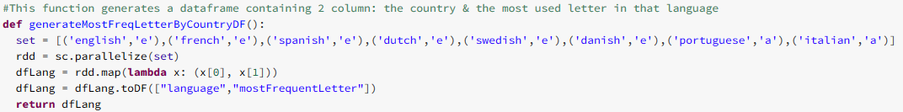 
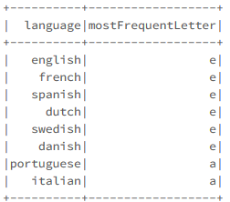 

We then need to do our heuristic analysis on the text.

### Hadoop Map/Reduce

First step, we need the most frequent letter in or text. To do that we decided to create a Map/Reduce job on Hadoop able to count the number of times alphabetic characters appears

The code itself is close to the word count example: we read the file, let the input reader split every line, then in the mapper, we suppress spaces and non-alphabetical characters, then separate every char with a &quot;-&quot; to then split every char on that &quot;-&quot;. Doing that allow to have the character as a key and we put a 1 as the value. Then after the sort and shuffle, the reducer sum the 1 for each key ad gives us the count of each char in the file

(the full code will be given with the project but we only put here the important part)

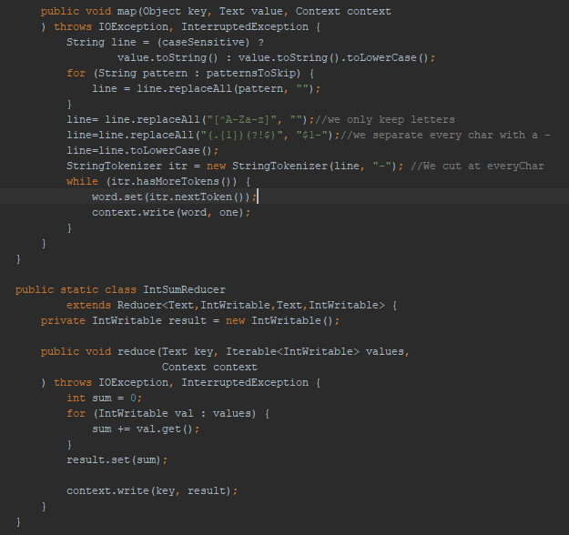 

To test our Map/Reduce we took a book as a text file (A Tale of Two Cities, by Charles Dickens) and we did 3 tests:

- One with the original version to see if &quot;a&quot; is really  most present letter (as it is supposed to be in English)
- One with a modified version where the &quot;e&quot; become &quot;h&quot; (ciphering key=3) and &quot;h&quot; become &quot;e&quot; (to only impact the most used letter)
- One with the fully ciphered version done by our previous Hadoop job

So we imported our jar of char counter on the cluster, and executed it on the 2

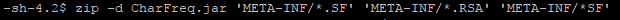 
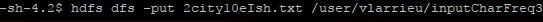 
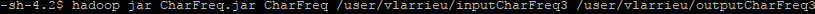 
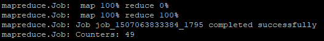 

We then compare the results:

 
 
 

(The first one is the original text, the second only the E are H and the third one is fully ciphered by 3 on the right)

- On the second job the most frequent letter is H as it should be
- On the third job, every letter count is shifted by 3, it means **our job work well**

Then we get our file back and import it to spark

### Import Hadoop result in Spark

- A function &quot;readHadoopFileDf&quot; generates a Dataframe with the output file of the M/R

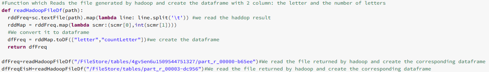 

### Adding a column to the generated dataframe

Then a column is added to the dataframe in order to allow a join witthe language Dataframe created before

- The function &quot;addFixedColumnToDF&quot; add a column language filled with the specified value
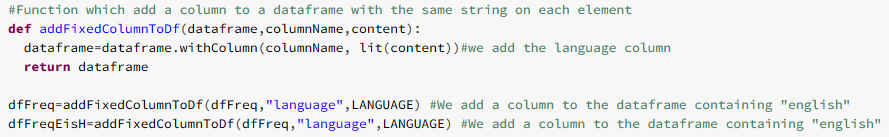 

We then need to join that result to the most frequent letter by language to be able to guess the ciphering key

- The function &quot;joinLangAndOutputDF&quot; returns a dataframe of one line and 4 column, one being the most used letter in this language and another one being the letter the most used in our text
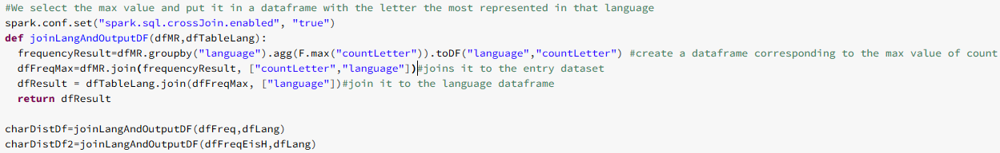 

When we visualize their content:
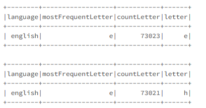 
- We can see that on the first file, the original text, the most frequent letter is e and the most frequent letter in that language (English) is e. That is normal since it is the plain text
- On the second example, we loaded a ciphered text shifted by 3 so the most frequent letter is there h

Now that we got the most frequent letter on the file, we need to know by how many our text has been shifted.

### Compute Distance between the most used letter in the text and in the language

We need to compute the difference between the 2 letters

- The function &quot;getCharDiff&quot; gives us the distance (as a value) between the reference (the most used letter in the language) and the given letter (the letter the most used in our text)

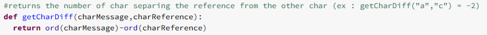 

We use it and see if the distance calculated is right:

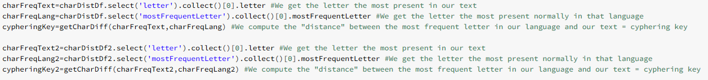 
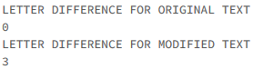 

- The result is right, the file 1 non modified has a distance of 0 and the modified file has the distance of 3 as expected

### Python Deciphering test

We test our functions now to decipher a column:

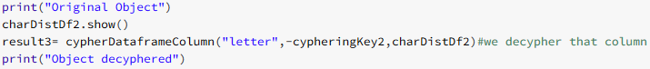 
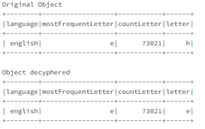 

- As we can see h became e, our deciphering function works

- As we can see were able to create a ciphering/deciphering method guessing the ciphering key (knowing the language and the type of ciphering)

# Improvement axes

- The ciphering/deciphering functions works but one part can be improved: when we join the most used letter in a language table with the most used letter in our text, this operation takes much more time than any other else. So one improvement axis would be to find a better/most efficient way
- An improvement would be to guess the language used just with the result of the frequency of the letters

## Implementation

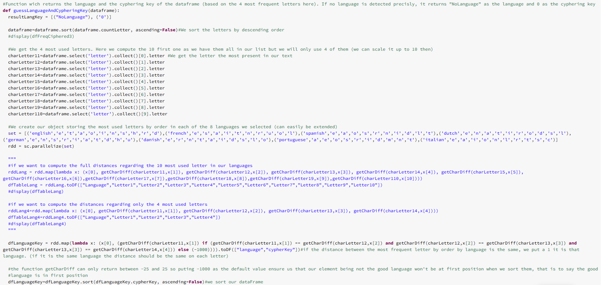 
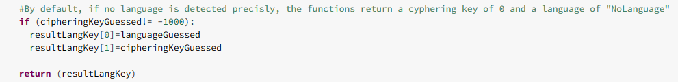 

- As we can see, to guess the language we class the result from our Hadoop job to have the letters by order of frequency.
- Then we extract them in variables (10 here but only 4 used so we can improve it)
- We compute the &quot;distance&quot; between each of those letters and the corresponding most used letter in each of the 8 languages proposed there (example here for the text ciphered by a key of 3)

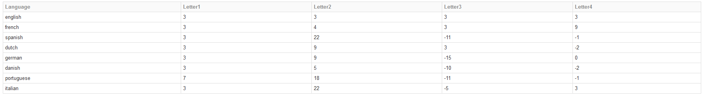 

- If for one language each of the distances are the same, we found our ciphering key and language then we return it (else we return a ciphering key of 0 and a language of &quot;NoLanguage&quot;)

- Result:

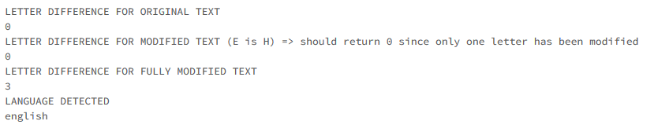 

### Comparison finding key with join and guessing it

- Using the language parameter and the join (on the 3 hadoop files)
 

Using the language parameter and the join (on the 3 hadoop files)
- Using the guessing method (language and key)
 

- As we can see out new method is almost **6 times faster** , but also **stronger** since it **guesses the language** and key

So to conclude that new implementation:

- Guessing the language the way we implemented it avoid the problem of the join which multiplied the computing time
- It also allowed us not to specify the language but still get the correct answer

# Files provided with the report

- txt: The text file on which we tested our code
- txt: The modified text file where only &quot;e&quot; letters are &quot;h&quot;
- jar: The jar which has been executed to generate the frequency of each char of the text (given as input)
- java: The source code used to generate the jar
- Cipher2.jar: The jar file able to cipher a text with a key given as the third parameter (can be 3 or -3 if needed)
- java: The source used to generate the jar
- txt: the code which gives the ciphering of the text if we specify the language
- txt: The code which guess the language and the ciphering key of the text
- part-r-00000-CharFreqFullyCiphered3: The result of the Char count Hadoop job on the ciphered text (key = 3)
- part-r-00000-CharFreqTextEisH: The result of the Char count Hadoop job on the original text where &quot;e&quot; became &quot;h&quot; (only)
- part-r-00000-CharFreqTextOriginal: The result of the Char count Hadoop job on the original text
- part-r-00000-CityCiphered3: The result of the Ciphering Hadoop job on the original text with a key of 3
- part-r-00000-CityDeciphered3: The result of the Deciphering Hadoop job on the ciphered text (key=3)

# Conclusion

Even though our project is not perfect at all, we succeeded to create a simple ciphering/deciphering method using character frequency. It allowed us to progress and learn new things but also to see some improvement axis and implement them.